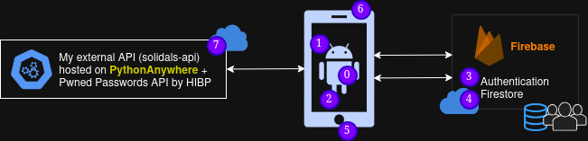
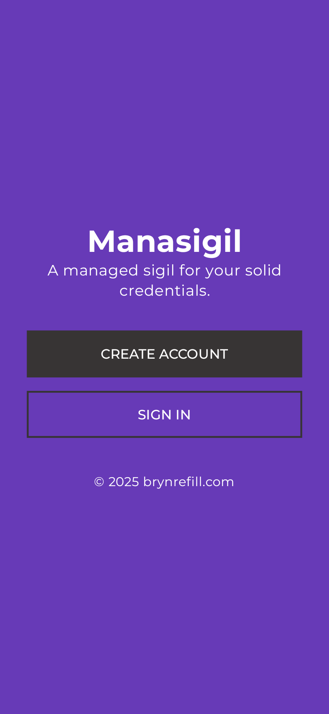
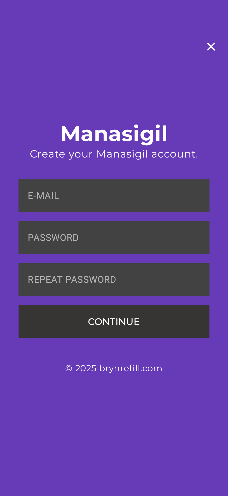
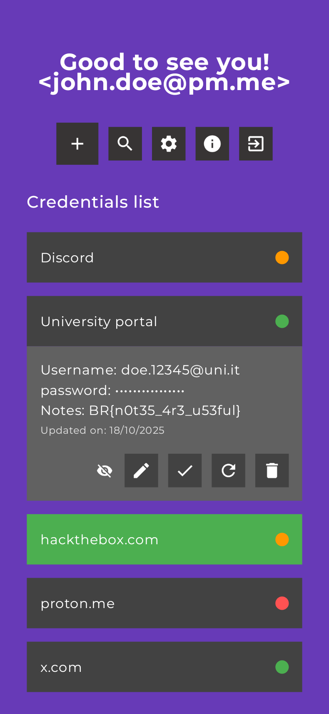

# manasigil
A minimal, user-friendly and cloud-based `Android` `password manager` built as a university project.

## Features and technologies

| N. | What | How |
| :---: | :-------- | :-------- |
| 0 | Development | `Kotlin` + `Android Studio` |
| 1 | UI and 2D Graphics (animation) | `Jetpack Compose` framework |
| 2 | Concurrency (animation) | `Kotlin Coroutines` |
| 3 | Multi-user auth | `Firebase Authentication` |
| 4 | NoSQL database for user data | `Cloud Firestore` |
| 5 | Local biometric auth | `Fingerprint sensor` |
| 6 | QR code scanning + image processing | `Camera sensor` + `ML Kit` |
| 7 | My external RESTful [Solidals API](https://github.com/brynrefill/solidals-api) | `Flask` + `PythonAnywhere` + |
|   |  | `Pwned Password API` by HIBP + `Retrofit` |

## Screenshots
The following screenshots represent a portion of the `initial version` of the app interface.

  
  
  
  

## Example of QR code to import

